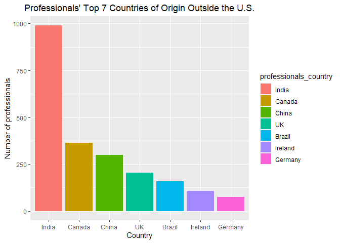
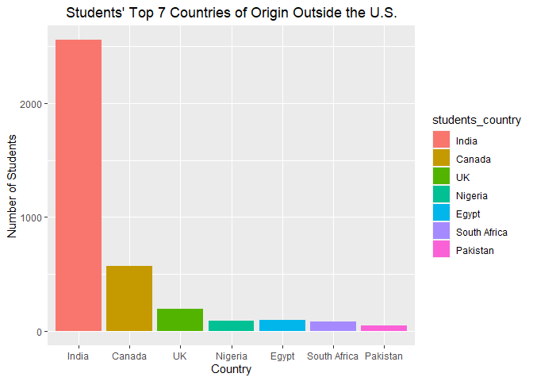

Career Village - Matching Users with Professionals
================

## Notebook Summary

This notebook is our initial look at the data to identify what we have
to work with, what issues exist with the data in its current form, and
how the data can best be aggregated for this project. After reading in
the data, we follow the outline below: - Observe table structures, data
types, and summary statistics, and identify key columns - Identify and
address initial errors, missing values, variable transformations, and
feature engineering - Aggregate required feature sets

------------------------------------------------------------------------

## 1. Read in the Data

``` r
# Locate and list files in the directory
file_list <- list.files(getwd(), full.names=T, pattern='*.csv')
filenames <- tools::file_path_sans_ext(basename(file_list))

# Read in all csv files into data frames
for (i in 1:length(file_list)) {
  df <- read.csv(file_list[i], header=T, na.strings=c('NA',''))
  assign(filenames[i], df)
}
```

## 2a. Variable summaries

``` r
for (i in 1:length(filenames)) {
  cat(filenames[i], "\n", "\n")
  print(summary(get(as.name(filenames[i]))))
  cat('_______________________________________________________________________________________', "\n")
}
```

    ## answer_scores 
    ##  
    ##       id                score        
    ##  Length:51138       Min.   : 0.0000  
    ##  Class :character   1st Qu.: 0.0000  
    ##  Mode  :character   Median : 0.0000  
    ##                     Mean   : 0.4158  
    ##                     3rd Qu.: 1.0000  
    ##                     Max.   :30.0000  
    ## _______________________________________________________________________________________ 
    ## answers 
    ##  
    ##   answers_id        answers_author_id  answers_question_id answers_date_added
    ##  Length:51123       Length:51123       Length:51123        Length:51123      
    ##  Class :character   Class :character   Class :character    Class :character  
    ##  Mode  :character   Mode  :character   Mode  :character    Mode  :character  
    ##  answers_body      
    ##  Length:51123      
    ##  Class :character  
    ##  Mode  :character  
    ## _______________________________________________________________________________________ 
    ## comments 
    ##  
    ##  comments_id        comments_author_id comments_parent_content_id
    ##  Length:14966       Length:14966       Length:14966              
    ##  Class :character   Class :character   Class :character          
    ##  Mode  :character   Mode  :character   Mode  :character          
    ##  comments_date_added comments_body     
    ##  Length:14966        Length:14966      
    ##  Class :character    Class :character  
    ##  Mode  :character    Mode  :character  
    ## _______________________________________________________________________________________ 
    ## emails 
    ##  
    ##    emails_id       emails_recipient_id emails_date_sent  
    ##  Min.   :    106   Length:1850101      Length:1850101    
    ##  1st Qu.: 881390   Class :character    Class :character  
    ##  Median :1400010   Mode  :character    Mode  :character  
    ##  Mean   :1362206                                         
    ##  3rd Qu.:1911846                                         
    ##  Max.   :2409829                                         
    ##  emails_frequency_level
    ##  Length:1850101        
    ##  Class :character      
    ##  Mode  :character      
    ##                        
    ##                        
    ##                        
    ## _______________________________________________________________________________________ 
    ## group_memberships 
    ##  
    ##  group_memberships_group_id group_memberships_user_id
    ##  Length:1038                Length:1038              
    ##  Class :character           Class :character         
    ##  Mode  :character           Mode  :character         
    ## _______________________________________________________________________________________ 
    ## groups 
    ##  
    ##   groups_id         groups_group_type 
    ##  Length:49          Length:49         
    ##  Class :character   Class :character  
    ##  Mode  :character   Mode  :character  
    ## _______________________________________________________________________________________ 
    ## matches 
    ##  
    ##  matches_email_id  matches_question_id
    ##  Min.   :    106   Length:4316275     
    ##  1st Qu.:1011924   Class :character   
    ##  Median :1544656   Mode  :character   
    ##  Mean   :1478192                      
    ##  3rd Qu.:1970643                      
    ##  Max.   :2409829                      
    ## _______________________________________________________________________________________ 
    ## professionals 
    ##  
    ##  professionals_id   professionals_location professionals_industry
    ##  Length:28152       Length:28152           Length:28152          
    ##  Class :character   Class :character       Class :character      
    ##  Mode  :character   Mode  :character       Mode  :character      
    ##  professionals_headline professionals_date_joined
    ##  Length:28152           Length:28152             
    ##  Class :character       Class :character         
    ##  Mode  :character       Mode  :character         
    ## _______________________________________________________________________________________ 
    ## question_scores 
    ##  
    ##       id                score      
    ##  Length:23928       Min.   :  0.0  
    ##  Class :character   1st Qu.:  1.0  
    ##  Mode  :character   Median :  2.0  
    ##                     Mean   :  2.9  
    ##                     3rd Qu.:  3.0  
    ##                     Max.   :125.0  
    ## _______________________________________________________________________________________ 
    ## questions 
    ##  
    ##  questions_id       questions_author_id questions_date_added questions_title   
    ##  Length:23931       Length:23931        Length:23931         Length:23931      
    ##  Class :character   Class :character    Class :character     Class :character  
    ##  Mode  :character   Mode  :character    Mode  :character     Mode  :character  
    ##  questions_body    
    ##  Length:23931      
    ##  Class :character  
    ##  Mode  :character  
    ## _______________________________________________________________________________________ 
    ## school_memberships 
    ##  
    ##  school_memberships_school_id school_memberships_user_id
    ##  Min.   : 69421               Length:5638               
    ##  1st Qu.:125574               Class :character          
    ##  Median :196934               Mode  :character          
    ##  Mean   :167256                                         
    ##  3rd Qu.:198771                                         
    ##  Max.   :214607                                         
    ## _______________________________________________________________________________________ 
    ## students 
    ##  
    ##  students_id        students_location  students_date_joined
    ##  Length:30971       Length:30971       Length:30971        
    ##  Class :character   Class :character   Class :character    
    ##  Mode  :character   Mode  :character   Mode  :character    
    ## _______________________________________________________________________________________ 
    ## tag_questions 
    ##  
    ##  tag_questions_tag_id tag_questions_question_id
    ##  Min.   :   27        Length:76553             
    ##  1st Qu.:11165        Class :character         
    ##  Median :18360        Mode  :character         
    ##  Mean   :17290                                 
    ##  3rd Qu.:26420                                 
    ##  Max.   :39250                                 
    ## _______________________________________________________________________________________ 
    ## tag_users 
    ##  
    ##  tag_users_tag_id tag_users_user_id 
    ##  Min.   :   27    Length:136663     
    ##  1st Qu.:18065    Class :character  
    ##  Median :18807    Mode  :character  
    ##  Mean   :18972                      
    ##  3rd Qu.:24132                      
    ##  Max.   :39261                      
    ## _______________________________________________________________________________________ 
    ## tags 
    ##  
    ##   tags_tag_id    tags_tag_name     
    ##  Min.   :   27   Length:16269      
    ##  1st Qu.:21711   Class :character  
    ##  Median :31101   Mode  :character  
    ##  Mean   :28512                     
    ##  3rd Qu.:35207                     
    ##  Max.   :39276                     
    ## _______________________________________________________________________________________

## 2b. Count of NA values

``` r
for (i in 1:length(filenames)) {
  cat(filenames[i], "\n", "\n")
  print(sapply(get(as.name(filenames[i])), function(x) sum(is.na(x))))
  cat('_______________________________________________________________________________________', "\n")
}
```

    ## answer_scores 
    ##  
    ##    id score 
    ##     0     0 
    ## _______________________________________________________________________________________ 
    ## answers 
    ##  
    ##          answers_id   answers_author_id answers_question_id  answers_date_added 
    ##                   0                   0                   0                   0 
    ##        answers_body 
    ##                   1 
    ## _______________________________________________________________________________________ 
    ## comments 
    ##  
    ##                comments_id         comments_author_id 
    ##                          0                          0 
    ## comments_parent_content_id        comments_date_added 
    ##                          0                          0 
    ##              comments_body 
    ##                          4 
    ## _______________________________________________________________________________________ 
    ## emails 
    ##  
    ##              emails_id    emails_recipient_id       emails_date_sent 
    ##                      0                      0                      0 
    ## emails_frequency_level 
    ##                      0 
    ## _______________________________________________________________________________________ 
    ## group_memberships 
    ##  
    ## group_memberships_group_id  group_memberships_user_id 
    ##                          0                          0 
    ## _______________________________________________________________________________________ 
    ## groups 
    ##  
    ##         groups_id groups_group_type 
    ##                 0                 0 
    ## _______________________________________________________________________________________ 
    ## matches 
    ##  
    ##    matches_email_id matches_question_id 
    ##                   0                   0 
    ## _______________________________________________________________________________________ 
    ## professionals 
    ##  
    ##          professionals_id    professionals_location    professionals_industry 
    ##                         0                      3098                      2576 
    ##    professionals_headline professionals_date_joined 
    ##                      2067                         0 
    ## _______________________________________________________________________________________ 
    ## question_scores 
    ##  
    ##    id score 
    ##     0     0 
    ## _______________________________________________________________________________________ 
    ## questions 
    ##  
    ##         questions_id  questions_author_id questions_date_added 
    ##                    0                    0                    0 
    ##      questions_title       questions_body 
    ##                    0                    0 
    ## _______________________________________________________________________________________ 
    ## school_memberships 
    ##  
    ## school_memberships_school_id   school_memberships_user_id 
    ##                            0                            0 
    ## _______________________________________________________________________________________ 
    ## students 
    ##  
    ##          students_id    students_location students_date_joined 
    ##                    0                 2033                    0 
    ## _______________________________________________________________________________________ 
    ## tag_questions 
    ##  
    ##      tag_questions_tag_id tag_questions_question_id 
    ##                         0                         0 
    ## _______________________________________________________________________________________ 
    ## tag_users 
    ##  
    ##  tag_users_tag_id tag_users_user_id 
    ##                 0                 0 
    ## _______________________________________________________________________________________ 
    ## tags 
    ##  
    ##   tags_tag_id tags_tag_name 
    ##             0             1 
    ## _______________________________________________________________________________________

### Initial decisions on missing values.

With no reasonable way to impute professionals’ or students’ missing
information, we will include the value “Not specified” in order to keep
those records and potentially discover trends that relate meaningfully
to users who chose not to enter those fields. Since the location field
is a combination of city and state or country which we will not use in
its current form, we will impute the “Not Specified” value into newly
engineered columns for state and US division.

We will simply drop the one tag with no name, and 1 answer with no body.
Further actions on missing values will likely become necessary later as
certain tables are merged.

## 2c. Variable structures

``` r
for (i in 1:length(filenames)) {
  cat(filenames[i], "\n", "\n")
  print(str(get(as.name(filenames[i]))))
  cat('_______________________________________________________________________________________', "\n")
}
```

    ## answer_scores 
    ##  
    ## 'data.frame':    51138 obs. of  2 variables:
    ##  $ id   : chr  "7b2bb0fc0d384e298cffa6afde9cf6ab" "7640a6e5d5224c8681cc58de860858f4" "3ce32e236fa9435183b2180fb213375c" "fa30fe4c016043e382c441a7ef743bfb" ...
    ##  $ score: int  1 5 2 0 2 1 1 3 3 1 ...
    ## NULL
    ## _______________________________________________________________________________________ 
    ## answers 
    ##  
    ## 'data.frame':    51123 obs. of  5 variables:
    ##  $ answers_id         : chr  "4e5f01128cae4f6d8fd697cec5dca60c" "ada720538c014e9b8a6dceed09385ee3" "eaa66ef919bc408ab5296237440e323f" "1a6b3749d391486c9e371fbd1e605014" ...
    ##  $ answers_author_id  : chr  "36ff3b3666df400f956f8335cf53e09e" "2aa47af241bf42a4b874c453f0381bd4" "cbd8f30613a849bf918aed5c010340be" "7e72a630c303442ba92ff00e8ea451df" ...
    ##  $ answers_question_id: chr  "332a511f1569444485cf7a7a556a5e54" "eb80205482e4424cad8f16bc25aa2d9c" "eb80205482e4424cad8f16bc25aa2d9c" "4ec31632938a40b98909416bdd0decff" ...
    ##  $ answers_date_added : chr  "2016-04-29 19:40:14 UTC+0000" "2018-05-01 14:19:08 UTC+0000" "2018-05-02 02:41:02 UTC+0000" "2017-05-10 19:00:47 UTC+0000" ...
    ##  $ answers_body       : chr  "<p>Hi!</p>\n<p>You are asking a very interesting question.  I am giving you two sites that will give you some o"| __truncated__ "<p>Hi. I joined the Army after I attended college and received a Bachelor's Degree in Criminal Justice.  Commis"| __truncated__ "<p>Dear Priyanka,</p><p>Greetings! I have answered this question to Eshwari few days ago. I am going to reprodu"| __truncated__ "<p>I work for a global company who values highly international experience.  In fact, that is a key experience w"| __truncated__ ...
    ## NULL
    ## _______________________________________________________________________________________ 
    ## comments 
    ##  
    ## 'data.frame':    14966 obs. of  5 variables:
    ##  $ comments_id               : chr  "f30250d3c2ca489db1afa9b95d481e08" "ca9bfc4ba9464ea383a8b080301ad72c" "c354f6e33956499aa8b03798a60e9386" "73a6223948714c5da6231937157e4cb7" ...
    ##  $ comments_author_id        : chr  "9fc88a7c3323466dbb35798264c7d497" "de2415064b9b445c8717425ed70fd99a" "6ed20605002a42b0b8e3d6ac97c50c7f" "d02f6d9faac24997a7003a59e5f34bd3" ...
    ##  $ comments_parent_content_id: chr  "b476f9c6d9cd4c50a7bacdd90edd015a" "ef4b6ae24d1f4c3b977731e8189c7fd7" "ca7a9d7a95df471c816db82ee758f57d" "c7a88aa76f5f49b0830bfeb46ba17e4d" ...
    ##  $ comments_date_added       : chr  "2019-01-31 23:39:40 UTC+0000" "2019-01-31 20:30:47 UTC+0000" "2019-01-31 18:44:04 UTC+0000" "2019-01-31 17:53:28 UTC+0000" ...
    ##  $ comments_body             : chr  "First, you speak to recruiters. They are trained and knowledgable on all the requirements for each branch of se"| __truncated__ "Most large universities offer study abroad programs.  The study abroad programs are found on the schools websit"| __truncated__ "First, I want to put you at ease that the opposite can happen.  My dormmate that I was paired with my freshman "| __truncated__ "Your question submission was great! I just wanted to point out that if you break your original question into se"| __truncated__ ...
    ## NULL
    ## _______________________________________________________________________________________ 
    ## emails 
    ##  
    ## 'data.frame':    1850101 obs. of  4 variables:
    ##  $ emails_id             : int  2337714 2336077 2314660 2312639 2299700 2288533 2280818 2270520 2269277 2267396 ...
    ##  $ emails_recipient_id   : chr  "0c673e046d824ec0ad0ebe012a0673e4" "0c673e046d824ec0ad0ebe012a0673e4" "0c673e046d824ec0ad0ebe012a0673e4" "0c673e046d824ec0ad0ebe012a0673e4" ...
    ##  $ emails_date_sent      : chr  "2018-12-07 01:05:40 UTC+0000" "2018-12-06 01:14:15 UTC+0000" "2018-11-17 00:38:27 UTC+0000" "2018-11-16 00:32:19 UTC+0000" ...
    ##  $ emails_frequency_level: chr  "email_notification_daily" "email_notification_daily" "email_notification_daily" "email_notification_daily" ...
    ## NULL
    ## _______________________________________________________________________________________ 
    ## group_memberships 
    ##  
    ## 'data.frame':    1038 obs. of  2 variables:
    ##  $ group_memberships_group_id: chr  "eabbdf4029734c848a9da20779637d03" "eabbdf4029734c848a9da20779637d03" "eabbdf4029734c848a9da20779637d03" "eabbdf4029734c848a9da20779637d03" ...
    ##  $ group_memberships_user_id : chr  "9a5aead62c344207b2624dba90985dc5" "ea7122da1c7b4244a2184a4f9f944053" "cba603f34acb4a40b3ccb53fe6681b5d" "fa9a126e63714641ae0145557a390cab" ...
    ## NULL
    ## _______________________________________________________________________________________ 
    ## groups 
    ##  
    ## 'data.frame':    49 obs. of  2 variables:
    ##  $ groups_id        : chr  "eabbdf4029734c848a9da20779637d03" "7080bf8dcf78463bb03e6863887fd715" "bc6fc50a2b444efc8ec47111b290ffb8" "37f002e8d5e442ca8e36e972eaa55882" ...
    ##  $ groups_group_type: chr  "youth program" "youth program" "youth program" "youth program" ...
    ## NULL
    ## _______________________________________________________________________________________ 
    ## matches 
    ##  
    ## 'data.frame':    4316275 obs. of  2 variables:
    ##  $ matches_email_id   : int  1721939 1665388 1636634 1635498 1620298 1618336 1610422 1601694 1568908 1551730 ...
    ##  $ matches_question_id: chr  "332a511f1569444485cf7a7a556a5e54" "332a511f1569444485cf7a7a556a5e54" "332a511f1569444485cf7a7a556a5e54" "332a511f1569444485cf7a7a556a5e54" ...
    ## NULL
    ## _______________________________________________________________________________________ 
    ## professionals 
    ##  
    ## 'data.frame':    28152 obs. of  5 variables:
    ##  $ professionals_id         : chr  "9ced4ce7519049c0944147afb75a8ce3" "f718dcf6d2ec4cb0a52a9db59d7f9e67" "0c673e046d824ec0ad0ebe012a0673e4" "977428d851b24183b223be0eb8619a8c" ...
    ##  $ professionals_location   : chr  NA NA "New York, New York" "Boston, Massachusetts" ...
    ##  $ professionals_industry   : chr  NA NA NA NA ...
    ##  $ professionals_headline   : chr  NA NA NA NA ...
    ##  $ professionals_date_joined: chr  "2011-10-05 20:35:19 UTC+0000" "2011-10-05 20:49:21 UTC+0000" "2011-10-18 17:31:26 UTC+0000" "2011-11-09 20:39:29 UTC+0000" ...
    ## NULL
    ## _______________________________________________________________________________________ 
    ## question_scores 
    ##  
    ## 'data.frame':    23928 obs. of  2 variables:
    ##  $ id   : chr  "38436aadef3d4b608ad089cf53ab0fe7" "edb8c179c5d64c9cb812a59a32045f55" "333464d7484b43e3866e86096bc4ddb9" "4b995e60b99d4ee18346e893e007cb8f" ...
    ##  $ score: int  5 4 6 6 6 1 1 5 6 5 ...
    ## NULL
    ## _______________________________________________________________________________________ 
    ## questions 
    ##  
    ## 'data.frame':    23931 obs. of  5 variables:
    ##  $ questions_id        : chr  "332a511f1569444485cf7a7a556a5e54" "eb80205482e4424cad8f16bc25aa2d9c" "4ec31632938a40b98909416bdd0decff" "2f6a9a99d9b24e5baa50d40d0ba50a75" ...
    ##  $ questions_author_id : chr  "8f6f374ffd834d258ab69d376dd998f5" "acccbda28edd4362ab03fb8b6fd2d67b" "f2c179a563024ccc927399ce529094b5" "2c30ffba444e40eabb4583b55233a5a4" ...
    ##  $ questions_date_added: chr  "2016-04-26 11:14:26 UTC+0000" "2016-05-20 16:48:25 UTC+0000" "2017-02-08 19:13:38 UTC+0000" "2017-09-01 14:05:32 UTC+0000" ...
    ##  $ questions_title     : chr  "Teacher   career   question" "I want to become an army officer. What can I do to become an army officer?" "Will going abroad for your first job increase your chances for jobs back home?" "To become a specialist in business  management, will I have to network myself?" ...
    ##  $ questions_body      : chr  "What  is  a  maths  teacher?   what  is  a  maths  teacher  useful? #college #professor #lecture" "I am Priyanka from Bangalore . Now am in 10th std . When I go to college I should not get confused on what I wa"| __truncated__ "I'm planning on going abroad for my first job. It will be a teaching job and I don't have any serious career id"| __truncated__ "i hear business management is a hard way to get a job if you're not known in the right areas. #business #networking " ...
    ## NULL
    ## _______________________________________________________________________________________ 
    ## school_memberships 
    ##  
    ## 'data.frame':    5638 obs. of  2 variables:
    ##  $ school_memberships_school_id: int  197406 197398 199821 186239 182063 197893 197913 198515 197922 102979 ...
    ##  $ school_memberships_user_id  : chr  "23dce13ca6164a73aec7a3cd56a4884d" "23dce13ca6164a73aec7a3cd56a4884d" "23dce13ca6164a73aec7a3cd56a4884d" "9c5803ae43ca4cf6b27ea85871625116" ...
    ## NULL
    ## _______________________________________________________________________________________ 
    ## students 
    ##  
    ## 'data.frame':    30971 obs. of  3 variables:
    ##  $ students_id         : chr  "12a89e96755a4dba83ff03e03043d9c0" "e37a5990fe354c60be5e87376b08d5e3" "12b402cceeda43dcb6e12ef9f2d221ea" "a0f431fc79794edcb104f68ce55ab897" ...
    ##  $ students_location   : chr  NA NA NA NA ...
    ##  $ students_date_joined: chr  "2011-12-16 14:19:24 UTC+0000" "2011-12-27 03:02:44 UTC+0000" "2012-01-01 05:00:00 UTC+0000" "2012-01-01 05:00:00 UTC+0000" ...
    ## NULL
    ## _______________________________________________________________________________________ 
    ## tag_questions 
    ##  
    ## 'data.frame':    76553 obs. of  2 variables:
    ##  $ tag_questions_tag_id     : int  28930 28930 28930 28930 28930 28930 28930 28930 28930 28930 ...
    ##  $ tag_questions_question_id: chr  "cb43ebee01364c68ac61d347a393ae39" "47f55e85ce944242a5a347ab85a8ffb4" "ccc30a033a0f4dfdb2eb987012f25792" "e30b274e48d741f7bf50eb5e7171a3c0" ...
    ## NULL
    ## _______________________________________________________________________________________ 
    ## tag_users 
    ##  
    ## 'data.frame':    136663 obs. of  2 variables:
    ##  $ tag_users_tag_id : int  593 1642 638 11093 21539 1047 64 1139 55 54 ...
    ##  $ tag_users_user_id: chr  "c72ab38e073246e88da7e9a4ec7a4472" "8db519781ec24f2e8bdc67c2ac53f614" "042d2184ee3e4e548fc3589baaa69caf" "c660bd0dc1b34224be78a58aa5a84a63" ...
    ## NULL
    ## _______________________________________________________________________________________ 
    ## tags 
    ##  
    ## 'data.frame':    16269 obs. of  2 variables:
    ##  $ tags_tag_id  : int  27490 461 593 27292 18217 54 129 89 53 55 ...
    ##  $ tags_tag_name: chr  "college" "computer-science" "computer-software" "business" ...
    ## NULL
    ## _______________________________________________________________________________________

### 2d. Heads of each table

``` r
for (i in 1:length(filenames)) {
  cat(filenames[i], "\n", "\n")
  print(head(get(as.name(filenames[i]))))
  cat('_______________________________________________________________________________________', "\n")
}
```

    ## answer_scores 
    ##  
    ##                                 id score
    ## 1 7b2bb0fc0d384e298cffa6afde9cf6ab     1
    ## 2 7640a6e5d5224c8681cc58de860858f4     5
    ## 3 3ce32e236fa9435183b2180fb213375c     2
    ## 4 fa30fe4c016043e382c441a7ef743bfb     0
    ## 5 71229eb293314c8a9e545057ecc32c93     2
    ## 6 7d1a41e5ef48410fa7ff647a4bf87eed     1
    ## _______________________________________________________________________________________ 
    ## answers 
    ##  
    ##                         answers_id                answers_author_id
    ## 1 4e5f01128cae4f6d8fd697cec5dca60c 36ff3b3666df400f956f8335cf53e09e
    ## 2 ada720538c014e9b8a6dceed09385ee3 2aa47af241bf42a4b874c453f0381bd4
    ## 3 eaa66ef919bc408ab5296237440e323f cbd8f30613a849bf918aed5c010340be
    ## 4 1a6b3749d391486c9e371fbd1e605014 7e72a630c303442ba92ff00e8ea451df
    ## 5 5229c514000446d582050f89ebd4e184 17802d94699140b0a0d2995f30c034c6
    ## 6 5f62fadae80748c7907e3b0551bf4203 b03c3872daeb4a5cb1d8cd510942f0c4
    ##                answers_question_id           answers_date_added
    ## 1 332a511f1569444485cf7a7a556a5e54 2016-04-29 19:40:14 UTC+0000
    ## 2 eb80205482e4424cad8f16bc25aa2d9c 2018-05-01 14:19:08 UTC+0000
    ## 3 eb80205482e4424cad8f16bc25aa2d9c 2018-05-02 02:41:02 UTC+0000
    ## 4 4ec31632938a40b98909416bdd0decff 2017-05-10 19:00:47 UTC+0000
    ## 5 2f6a9a99d9b24e5baa50d40d0ba50a75 2017-10-13 22:07:33 UTC+0000
    ## 6 2f6a9a99d9b24e5baa50d40d0ba50a75 2017-10-12 16:01:44 UTC+0000
    ##                                                                                                                                                                                                                                                                                                                                                                                                                                                                                                                                                                                                                                                                                                                                                                                                                                                                                                                                                                                                                                                                                                                                                                                                                                                                                                                                                                                                                                                                                                                                                                                                                                                                                                                                                                                                                                                                                                                                                                                                                                                                                                                                                                                                                                                                                                                                                                                                                                                                                                                                                                                                                                                                                                                                                                                                                                                                                                                                                                                                                                                                                                                                                   answers_body
    ## 1                                                                                                                                                                                                                                                                                                                                                                                                                                                                                                                                                                                                                                                                                                                                                                                                                                                                                                                                                                                                                                                                                                                                                                                                                                                                                                                                                                                                                                                                                                                                                                                                                                                                                                                                                                                                                                                                                                                                                                                                                                                                                                                                                                                                                                                                                                                                                                                                                                                                                                                                                                                                                                                                                                                                                                                                                  <p>Hi!</p>\n<p>You are asking a very interesting question.  I am giving you two sites that will give you some of an explanation that may answer your question.</p>\n<p>http://mathforum.org/dr.math/faq/faq.why.math.html</p>\n<p>http://www.mathworksheetscenter.com/mathtips/mathissoimportant.html</p>\n<p>Let me know if this helps</p>
    ## 2                                                                                                                                                                                                                                                                                                                                                                                                                                                                                                                                                                                                                                                                                                                                                                                                                                                                                                                                                                                                                                                                                                                                                                                                                                                                                                                                                                                                                                                                                                                                                                                                                                                                                                                                                                                                                                                                                                                                                                                                                                                                                                                                                                                                                                                                                                                                                                                                                                                     <p>Hi. I joined the Army after I attended college and received a Bachelor's Degree in Criminal Justice.  Commissioned officers enter the Military with a four year degree or receive officer training after joining and complete a tour. You can prepare yourself by taking Reserve Officer Training Corps (ROTC) while in high school or a university. You can also attend Officer Candidate School (OCS) after graduating from college or become commissioned by earning a professional degree. If you decide to earn a degree, think about what you would like to do while in the military.  The experience in the military was very rewarding. I wish you well and much success in your future. </p>
    ## 3 <p>Dear Priyanka,</p><p>Greetings! I have answered this question to Eshwari few days ago. I am going to reproduce that answer with bit of modifications as required for better clarity. </p><p><br></p><p>From your background, I could make out that you are from Bangalore and a student of 10th standard but your location is Rhode Island, USA. So I am not very clear as to which Army you wish to join ? Is it the US Army or the Indian Army? It is important to know that very few foreign nationals can join Indian Army (like Nepali citizens etc.). So you have to ascertain for yourself as to which citizenship you hold and accordingly you can join armed forces of the respective countries. Both are highly professional armies and respected a lot. I shall answer the modalities about the Indian Army, assuming that is the natural choice.</p><p><br></p><p>So, to answer your query, there are following options for you to become army officer:</p><ol><li> Do your B.Sc  and that will be good as you have wider choices including flying branches in air force and executive branches in Navy. Similarly BA/B.Com if you are not looking for flying or executive branches. </li><li>  Should you wish to be doctor in Army then you can appear for entrance Test for AFMC, Pune or Army Dental College after class 12th with PCMB. However, you can do the same by attending Medical colleges from civil institutes in India/abroad.  </li><li> You can also join Military Nursing Services after B.Sc or Diploma in Nursing but majority of them are trained within army organisations (after 12th only  with PCMB). </li><li> You can join after doing your graduation in Engineering (Civil, Mech, Electrical, Electronics or Computer Sciences) or Masters in Physics with Electronics or Computers for engineering branches.</li><li>You can also join in Education Corps by doing M.Sc/MA/M.Com with or without B.Ed or in Legal services by doing your Law Degree. </li></ol><p><br></p><p>After your basic education, application and selection test processes, one has to clear SSB (Services Selection Board) which is a very stringent 5 days test (compulsory for all including Women officers except medical professionals). It is one of the best methods of test I know to assess the suitability for military services (as officers), a proven method of testing of one's psyche, leadership qualities which takes  all the aspects of your personality into account and decide.  Although, success rate is pretty low but don't get disheartened and demotivated. Key to success in SSB is a sound mind with sound body, positive attitude and basic IQ.  If I could do with an average IQ and humble  educational backgrounds, why not you?  There were many friends (within my batch) of whom we thought that they will never make it to the SSB but they did qualify and now serving as  Major General. </p><p>Please refer the links given below and you can find scores of material to read about SSB on the net or through books.</p><p>All the Very Best! Jai Hind!</p>&lt;h1&gt;<br>&lt;/h1&gt;<p><br></p>
    ## 4                                                                                                                                                                                                                                                                                                                                                                                                                                                                                                                                                                                                                                                                                                                                                                                                                                                                                                                                                                                                                                                                                                                                                                                                                                                                                                                                                                                                                                                                                                                                                                                                                                                                                                                                                                                                                                                                                                                                                                                                                                                                                                                                                                                                                                                                                                                                                                                                                                                                                                                                                                                                                                                                                                                                                  <p>I work for a global company who values highly international experience.  In fact, that is a key experience we look for in candidates.  Therefore, I'd say it would be wise to take advantage of the teaching opportunity - even if only for a year or 2.  You never know where it might lead and you will certainly have an edge on your return if you then look for employment in a global company.</p>
    ## 5                                                                                                                                                                                                                                                                                                                                                                                                                                                                                                                                                                                                                                                                                                                                                                                                                                                                                                                                                                                                                                                                                                                                                                                                                                                                                                                                                                                                                                                                                                                                                                                                                               I agree with Denise. Every single job I've had since my first internship in college, I've found through connections. I have also been surprised that in some cases, connections that I least expected were crucial in helping me find new opportunities. For example, I am about to start a new role that in a lot of ways, is my dream job. A few months ago, I connected with someone that used to be on my team at a different company. We only worked on the same team for about 2 months, and 5 years later, ended up working at another tech company in Seattle. He ended up being the hiring manager for this new role, and after passing the other interviews, I got the job. \n\nI would say the most important thing when starting your career is to define what you want your brand to be, and what you want to be known for. This will help give you guidance on what activities and events to prioritize, books to read, etc. \n\nIt's also essential to be mindful of the impression you leave with others. While networking is essential to building your career, it's important that it's also backed up by a reputation you feel proud about. \n\nAs a student, I remember this feeling like an incredibly daunting task. It made it easier for me to find a group I could relate to. I joined ALPFA, an association for Latino Professionals that work across various business disciplines. I would recommend finding an organization that speaks to you, and begin practicing your networking skills there.
    ## 6                                                                                                                                                                                                                                                                                                                                                                                                                                                                                                                                                                                                                                                                                                                                                                                                                                                                                                                                                                                                                                                                                                                                                                                                                                                                                                                                                                                                                                                                                                                                                                                                                                                                                                                                                                                                                                                                                                                                                                      Networking is a key component to progressing your career.  I've worked for several high tech organizations over many years and each job I was offered was because I knew someone who worked at the company who knew my skills and was able to advocate for me to get the job.  Without my professional and personal networks, it would have been much harder to get job offers and I may not have been as successful in my career.   \n\nDepending on the type of business/industry you would like to be in, you may have to start out as a team member or team contributor to grow your expertise in the business, possibly around a particular business function like operations, finance,  sales, etc.   As you become more knowledgeable and show your strengths in conducting your day to day work,  you will have a good chance to become a manager or leader of a team.   I do encourage you to take every networking opportunity that comes your way - join professional organizations, maybe your company or school offers networking activities you can join, and stay close to your social networks, you never know when a friend will help you find your next career move! 
    ## _______________________________________________________________________________________ 
    ## comments 
    ##  
    ##                        comments_id               comments_author_id
    ## 1 f30250d3c2ca489db1afa9b95d481e08 9fc88a7c3323466dbb35798264c7d497
    ## 2 ca9bfc4ba9464ea383a8b080301ad72c de2415064b9b445c8717425ed70fd99a
    ## 3 c354f6e33956499aa8b03798a60e9386 6ed20605002a42b0b8e3d6ac97c50c7f
    ## 4 73a6223948714c5da6231937157e4cb7 d02f6d9faac24997a7003a59e5f34bd3
    ## 5 55a89a9061d44dd19569c45f90a22779 e78f75c543e84e1c94da1801d8560f65
    ## 6 3661006cdb6f4595b193b8d9fbe21228 d02f6d9faac24997a7003a59e5f34bd3
    ##         comments_parent_content_id          comments_date_added
    ## 1 b476f9c6d9cd4c50a7bacdd90edd015a 2019-01-31 23:39:40 UTC+0000
    ## 2 ef4b6ae24d1f4c3b977731e8189c7fd7 2019-01-31 20:30:47 UTC+0000
    ## 3 ca7a9d7a95df471c816db82ee758f57d 2019-01-31 18:44:04 UTC+0000
    ## 4 c7a88aa76f5f49b0830bfeb46ba17e4d 2019-01-31 17:53:28 UTC+0000
    ## 5 c7a88aa76f5f49b0830bfeb46ba17e4d 2019-01-31 14:51:53 UTC+0000
    ## 6 30901132449849b2aa18f308306e89a2 2019-01-30 23:15:54 UTC+0000
    ##                                                                                                                                                                                                                                                                                                                                                                                                                                                                                                                                                                                                                                                                                                                                                                                               comments_body
    ## 1                                                                                                                                                                                                                                                                                                                                                          First, you speak to recruiters. They are trained and knowledgable on all the requirements for each branch of service and can do the research for you on the specific job that you are looking at. \n\nAdditionally, birds of a feather do flock together. In high school, you can join groups like the Civil Air Patrol. The Civil Air Patrol is the auxiliary of the Air Force and many former and retired Air Force member within their ranks.
    ## 2                                                                                                                                                                                 Most large universities offer study abroad programs.  The study abroad programs are found on the schools website.  You may have to click into the Undergraduate or Graduate links.   I also recommend reaching out to the university counselors.  The have wealth of information and details that may not be on the website. \n\nMy son will be studying in France and Sweden next year through DePaul University.   The University of Southern California has a very strong international program in which most students participate.  It's a great opportunity to learn the culture of other countries while in school.
    ## 3 First, I want to put you at ease that the opposite can happen.  My dormmate that I was paired with my freshman year of college turned into one of my very best friends.  Second, we lived with another girl during our sophomore year; a good friend of ours that lived next to us the previous year.  To us, she was the annoying dormmate that you are mentioning and we already knew her!  Sometimes it takes living with someone to learn their annoying habits.  We could have swapped if someone else agreed to swap with us.  Instead we tried to talk to her about it.  When it did not get better, my other dormmate and I strategized how we could avoid the annoying habits.  For instance, we agreed that the habits were most annoying when we were trying to study so we studied elsewhere.
    ## 4                                                                                                                                                                                                                                                                                                                                Your question submission was great! I just wanted to point out that if you break your original question into separate and slightly more specific points (like "In addition to the LSAT what is the Law School acceptance process like..." you might also get some great Advice from our professionals. General questions are always welcome too, just make sure to leave some detail (like you did) of why you are interested etc. Welcome to the CareerVillage community!
    ## 5                                                                                                                                                                                                                                                                                                                                                                                                                                                                                                                                                                                                                                                                                    Thank you. I'm new to this site. I'm sorry if what I put out there is spam. I will for sure read through those forums.
    ## 6                                                                                                                                                                                                                                                                                                                                                                                                                                                                                                                                                                                                                                                                                                                                                                   My pleasure! I'm so glad I was helpful!
    ## _______________________________________________________________________________________ 
    ## emails 
    ##  
    ##   emails_id              emails_recipient_id             emails_date_sent
    ## 1   2337714 0c673e046d824ec0ad0ebe012a0673e4 2018-12-07 01:05:40 UTC+0000
    ## 2   2336077 0c673e046d824ec0ad0ebe012a0673e4 2018-12-06 01:14:15 UTC+0000
    ## 3   2314660 0c673e046d824ec0ad0ebe012a0673e4 2018-11-17 00:38:27 UTC+0000
    ## 4   2312639 0c673e046d824ec0ad0ebe012a0673e4 2018-11-16 00:32:19 UTC+0000
    ## 5   2299700 0c673e046d824ec0ad0ebe012a0673e4 2018-11-08 00:16:40 UTC+0000
    ## 6   2288533 0c673e046d824ec0ad0ebe012a0673e4 2018-11-02 23:02:12 UTC+0000
    ##     emails_frequency_level
    ## 1 email_notification_daily
    ## 2 email_notification_daily
    ## 3 email_notification_daily
    ## 4 email_notification_daily
    ## 5 email_notification_daily
    ## 6 email_notification_daily
    ## _______________________________________________________________________________________ 
    ## group_memberships 
    ##  
    ##         group_memberships_group_id        group_memberships_user_id
    ## 1 eabbdf4029734c848a9da20779637d03 9a5aead62c344207b2624dba90985dc5
    ## 2 eabbdf4029734c848a9da20779637d03 ea7122da1c7b4244a2184a4f9f944053
    ## 3 eabbdf4029734c848a9da20779637d03 cba603f34acb4a40b3ccb53fe6681b5d
    ## 4 eabbdf4029734c848a9da20779637d03 fa9a126e63714641ae0145557a390cab
    ## 5 eabbdf4029734c848a9da20779637d03 299da113c5d1420ab525106c242c9429
    ## 6 7080bf8dcf78463bb03e6863887fd715 836a747118d6436caf56ff3a3c47289a
    ## _______________________________________________________________________________________ 
    ## groups 
    ##  
    ##                          groups_id groups_group_type
    ## 1 eabbdf4029734c848a9da20779637d03     youth program
    ## 2 7080bf8dcf78463bb03e6863887fd715     youth program
    ## 3 bc6fc50a2b444efc8ec47111b290ffb8     youth program
    ## 4 37f002e8d5e442ca8e36e972eaa55882     youth program
    ## 5 52419ff84d4b47bebd0b0a6c1263c296     youth program
    ## 6 559dbc7bd1f64c268ff149c4d5d63500     youth program
    ## _______________________________________________________________________________________ 
    ## matches 
    ##  
    ##   matches_email_id              matches_question_id
    ## 1          1721939 332a511f1569444485cf7a7a556a5e54
    ## 2          1665388 332a511f1569444485cf7a7a556a5e54
    ## 3          1636634 332a511f1569444485cf7a7a556a5e54
    ## 4          1635498 332a511f1569444485cf7a7a556a5e54
    ## 5          1620298 332a511f1569444485cf7a7a556a5e54
    ## 6          1618336 332a511f1569444485cf7a7a556a5e54
    ## _______________________________________________________________________________________ 
    ## professionals 
    ##  
    ##                   professionals_id professionals_location
    ## 1 9ced4ce7519049c0944147afb75a8ce3                   <NA>
    ## 2 f718dcf6d2ec4cb0a52a9db59d7f9e67                   <NA>
    ## 3 0c673e046d824ec0ad0ebe012a0673e4     New York, New York
    ## 4 977428d851b24183b223be0eb8619a8c  Boston, Massachusetts
    ## 5 e2d57e5041a44f489288397c9904c2b2                   <NA>
    ## 6 c9bfa93898594cbbace436deca644c64                   <NA>
    ##   professionals_industry professionals_headline    professionals_date_joined
    ## 1                   <NA>                   <NA> 2011-10-05 20:35:19 UTC+0000
    ## 2                   <NA>                   <NA> 2011-10-05 20:49:21 UTC+0000
    ## 3                   <NA>                   <NA> 2011-10-18 17:31:26 UTC+0000
    ## 4                   <NA>                   <NA> 2011-11-09 20:39:29 UTC+0000
    ## 5                   <NA>                   <NA> 2011-12-10 22:14:44 UTC+0000
    ## 6                   <NA>                   <NA> 2011-12-12 14:25:46 UTC+0000
    ## _______________________________________________________________________________________ 
    ## question_scores 
    ##  
    ##                                 id score
    ## 1 38436aadef3d4b608ad089cf53ab0fe7     5
    ## 2 edb8c179c5d64c9cb812a59a32045f55     4
    ## 3 333464d7484b43e3866e86096bc4ddb9     6
    ## 4 4b995e60b99d4ee18346e893e007cb8f     6
    ## 5 f6b9ca94aed04ba28256492708e74f60     6
    ## 6 216abb4056a64b198bdc6544830c822a     1
    ## _______________________________________________________________________________________ 
    ## questions 
    ##  
    ##                       questions_id              questions_author_id
    ## 1 332a511f1569444485cf7a7a556a5e54 8f6f374ffd834d258ab69d376dd998f5
    ## 2 eb80205482e4424cad8f16bc25aa2d9c acccbda28edd4362ab03fb8b6fd2d67b
    ## 3 4ec31632938a40b98909416bdd0decff f2c179a563024ccc927399ce529094b5
    ## 4 2f6a9a99d9b24e5baa50d40d0ba50a75 2c30ffba444e40eabb4583b55233a5a4
    ## 5 5af8880460c141dbb02971a1a8369529 aa9eb1a2ab184ebbb00dc01ab663428a
    ## 6 7c336403258f4da3a2e0955742c76462 d1e4587c0e784c62bc27eb8d16a07f38
    ##           questions_date_added
    ## 1 2016-04-26 11:14:26 UTC+0000
    ## 2 2016-05-20 16:48:25 UTC+0000
    ## 3 2017-02-08 19:13:38 UTC+0000
    ## 4 2017-09-01 14:05:32 UTC+0000
    ## 5 2017-09-01 02:36:54 UTC+0000
    ## 6 2017-03-01 04:27:08 UTC+0000
    ##                                                                               questions_title
    ## 1                                                                 Teacher   career   question
    ## 2                  I want to become an army officer. What can I do to become an army officer?
    ## 3              Will going abroad for your first job increase your chances for jobs back home?
    ## 4              To become a specialist in business  management, will I have to network myself?
    ## 5 Are there any scholarships out there for students that are first generation and live in GA?
    ## 6                                       How many years of coege do you need to be an engineer
    ##                                                                                                                                                                                                                                                                                                                                                                                                                                                                                     questions_body
    ## 1                                                                                                                                                                                                                                                                                                                                                                                                 What  is  a  maths  teacher?   what  is  a  maths  teacher  useful? #college #professor #lecture
    ## 2                                                                                                                                                                                                                                                                                                  I am Priyanka from Bangalore . Now am in 10th std . When I go to college I should not get confused on what I want to take to become army officer. So I am asking this question  #military #army
    ## 3 I'm planning on going abroad for my first job. It will be a teaching job and I don't have any serious career ideas. I don't know what job I would be working if I stay home instead so I'm assuming staying or leaving won't makeba huge difference in what I care about, unless I find something before my first job. I can think of ways that going abroad can be seen as good and bad. I do not know which side respectable employers willl side with. #working-abroad #employment- #overseas
    ## 4                                                                                                                                                                                                                                                                                                                                                                             i hear business management is a hard way to get a job if you're not known in the right areas. #business #networking 
    ## 5                                                                                                                                                                                                                                                                                                     I'm trying to find scholarships for first year students but they all seem to be for other states besides GA. Any help??\n\n#college\n#scholarships \n#highschoolsenior \n#firstgeneration \n
    ## 6                                                                                                                                                                                                                                                                                                                                                                                                                                                                 To be an engineer #united-states
    ## _______________________________________________________________________________________ 
    ## school_memberships 
    ##  
    ##   school_memberships_school_id       school_memberships_user_id
    ## 1                       197406 23dce13ca6164a73aec7a3cd56a4884d
    ## 2                       197398 23dce13ca6164a73aec7a3cd56a4884d
    ## 3                       199821 23dce13ca6164a73aec7a3cd56a4884d
    ## 4                       186239 9c5803ae43ca4cf6b27ea85871625116
    ## 5                       182063 9c5803ae43ca4cf6b27ea85871625116
    ## 6                       197893 9c5803ae43ca4cf6b27ea85871625116
    ## _______________________________________________________________________________________ 
    ## students 
    ##  
    ##                        students_id students_location
    ## 1 12a89e96755a4dba83ff03e03043d9c0              <NA>
    ## 2 e37a5990fe354c60be5e87376b08d5e3              <NA>
    ## 3 12b402cceeda43dcb6e12ef9f2d221ea              <NA>
    ## 4 a0f431fc79794edcb104f68ce55ab897              <NA>
    ## 5 23aea4702d804bd88d1e9fb28074a1b4              <NA>
    ## 6 18a8f9363cd24a37b690e1b205146b14              <NA>
    ##           students_date_joined
    ## 1 2011-12-16 14:19:24 UTC+0000
    ## 2 2011-12-27 03:02:44 UTC+0000
    ## 3 2012-01-01 05:00:00 UTC+0000
    ## 4 2012-01-01 05:00:00 UTC+0000
    ## 5 2012-01-01 05:00:00 UTC+0000
    ## 6 2012-01-01 05:00:00 UTC+0000
    ## _______________________________________________________________________________________ 
    ## tag_questions 
    ##  
    ##   tag_questions_tag_id        tag_questions_question_id
    ## 1                28930 cb43ebee01364c68ac61d347a393ae39
    ## 2                28930 47f55e85ce944242a5a347ab85a8ffb4
    ## 3                28930 ccc30a033a0f4dfdb2eb987012f25792
    ## 4                28930 e30b274e48d741f7bf50eb5e7171a3c0
    ## 5                28930 3d22742052df4989b311b4195cbb0f1a
    ## 6                28930 c79baebeb6d44726b6f70a2414fb69bc
    ## _______________________________________________________________________________________ 
    ## tag_users 
    ##  
    ##   tag_users_tag_id                tag_users_user_id
    ## 1              593 c72ab38e073246e88da7e9a4ec7a4472
    ## 2             1642 8db519781ec24f2e8bdc67c2ac53f614
    ## 3              638 042d2184ee3e4e548fc3589baaa69caf
    ## 4            11093 c660bd0dc1b34224be78a58aa5a84a63
    ## 5            21539 8ce1dca4e94240239e4385ed22ef43ce
    ## 6             1047 3330f8a7835346a2a91f9393ae21efee
    ## _______________________________________________________________________________________ 
    ## tags 
    ##  
    ##   tags_tag_id     tags_tag_name
    ## 1       27490           college
    ## 2         461  computer-science
    ## 3         593 computer-software
    ## 4       27292          business
    ## 5       18217            doctor
    ## 6          54       engineering
    ## _______________________________________________________________________________________

## 3. Missing Values, Transformations, and Feature Engineering

### answers

### comments

### emails

### group_memberships

### groups

### matches

### professionals

The script sourced below completes the following actions: <br> \*
Creates variable professionals_loc_div by binning professionals location
into U.S. Geographic Division <br> \* Creates variable
professionals_country by binning professionals location into country
<br> \* Transforms professionals_date_joined into datetime, and removes
hh:mm:ss <br> \* Imputes “Not Specified” for NA fields <br>

``` r
source("~/GitHub/Career-Village/Feature Engineering Scripts/pros_loc_div.R")
```

    ## 
    ## Attaching package: 'dplyr'

    ## The following objects are masked from 'package:stats':
    ## 
    ##     filter, lag

    ## The following objects are masked from 'package:base':
    ## 
    ##     intersect, setdiff, setequal, union

    ## 'data.frame':    28152 obs. of  7 variables:
    ##  $ professionals_id         : chr  "9ced4ce7519049c0944147afb75a8ce3" "f718dcf6d2ec4cb0a52a9db59d7f9e67" "0c673e046d824ec0ad0ebe012a0673e4" "977428d851b24183b223be0eb8619a8c" ...
    ##  $ professionals_location   : chr  "Not Specified" "Not Specified" "New York, New York" "Boston, Massachusetts" ...
    ##  $ professionals_industry   : chr  "Not Specified" "Not Specified" "Not Specified" "Not Specified" ...
    ##  $ professionals_headline   : chr  "Not Specified" "Not Specified" "Not Specified" "Not Specified" ...
    ##  $ professionals_date_joined: Date, format: "2011-10-05" "2011-10-05" ...
    ##  $ professionals_loc_div    : Factor w/ 11 levels "East North Central",..: 7 7 4 6 7 7 7 7 7 7 ...
    ##  $ professionals_country    : Factor w/ 150 levels "Afghanistan",..: 95 95 143 143 95 95 95 95 95 95 ...
    ## NULL

<!-- -->

### questions

### school_memberships

### students

The script sourced below completes the following actions: <br> \*
Creates variable students_loc_div by binning student location into U.S.
Geographic Division <br> \* Creates variable students_country by binning
student location into country <br> \* Transforms students_date_joined
into datetime, and removes hh:mm:ss <br> \* Imputes “Not Specified” for
NA fields <br>

``` r
source("~/GitHub/Career-Village/Feature Engineering Scripts/stud_loc_div.R")
```

    ## 'data.frame':    30971 obs. of  5 variables:
    ##  $ students_id         : chr  "12a89e96755a4dba83ff03e03043d9c0" "e37a5990fe354c60be5e87376b08d5e3" "12b402cceeda43dcb6e12ef9f2d221ea" "a0f431fc79794edcb104f68ce55ab897" ...
    ##  $ students_location   : chr  NA NA NA NA ...
    ##  $ students_date_joined: Date, format: "2011-12-16" "2011-12-27" ...
    ##  $ students_loc_div    : Factor w/ 11 levels "East North Central",..: 7 7 7 7 7 7 7 7 7 7 ...
    ##  $ students_country    : Factor w/ 132 levels "Afghanistan",..: 84 84 84 84 84 84 84 84 84 84 ...
    ## NULL

<!-- -->

### tag_questions

### tag_users

### tags

### question_scores

### answer_scores
